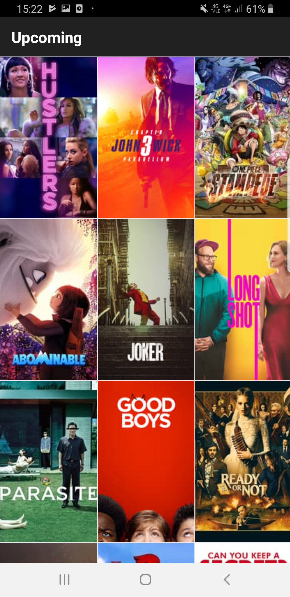
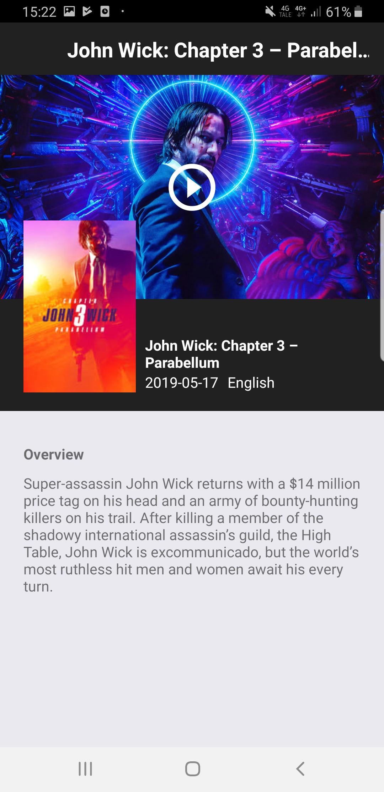
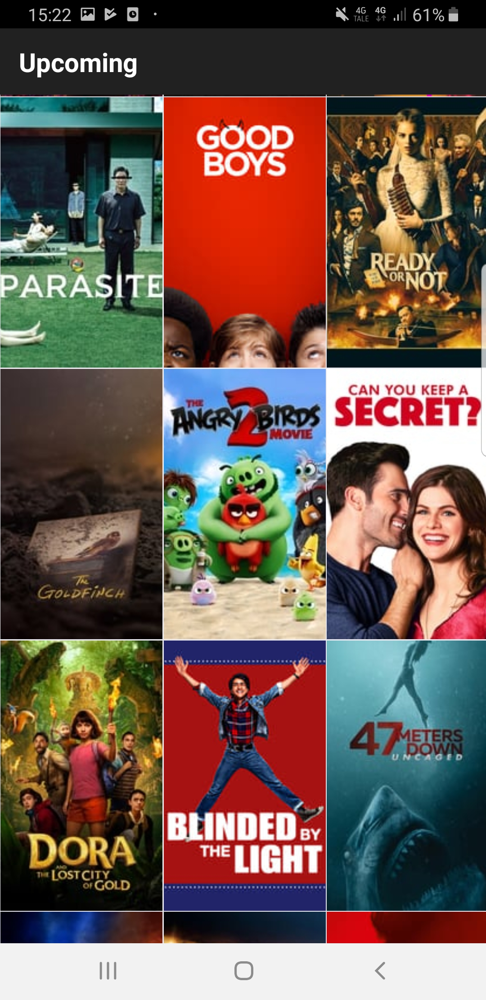
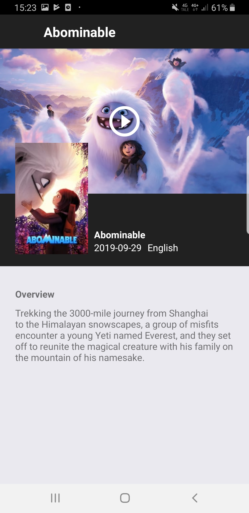

# SoonTM

App that shows upcoming movies from [The Movie Database][tmdb] in a gallery view. Each movie can be opened in a detailed view that shows the release date, language, story summary and a link to the trailer.

The app is written in [React Native][react-native] with [Redux][redux] for state management, and [Jest][jest] and [Enzyme][enzyme] for testing. 

Components are written with the [Container component][reactpatterns:container] pattern in mind.

 

  
  
   
  

[enzyme]: https://github.com/airbnb/enzyme
[jest]: https://jestjs.io/docs/en/getting-started
[react-native]: https://reactnative.dev/
[reactpatterns:container]: https://reactpatterns.com/#container-component
[redux]: https://redux.js.org/
[tmdb]: http://themoviedb.org/
